# How to install Debian

Table - Minimum System Requirements
| Component | Minimum Requirement |
|-----------|---------------------|
| Processor | 1 GHz single-core   |
| Memory    | 2 GB RAM            |
| Storage   | 25 GB               |


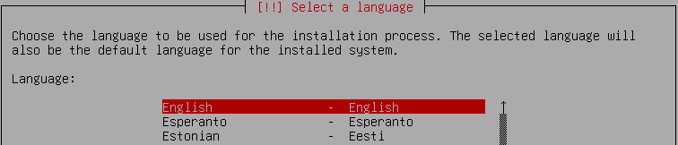

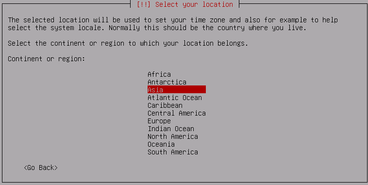

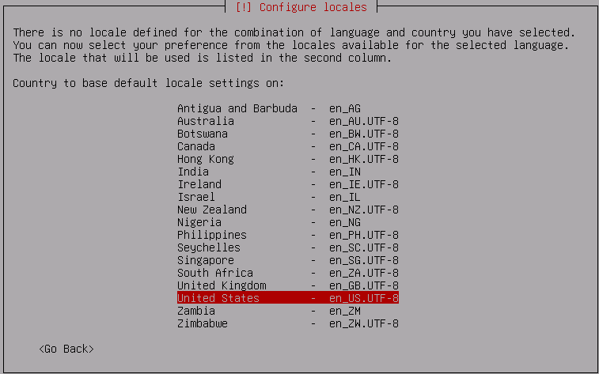


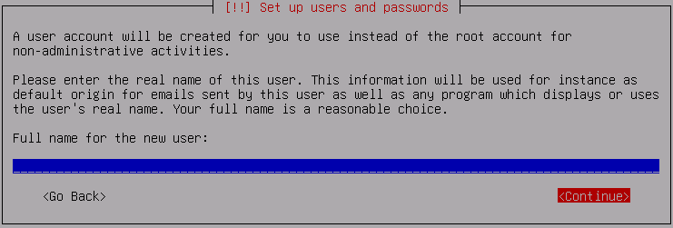

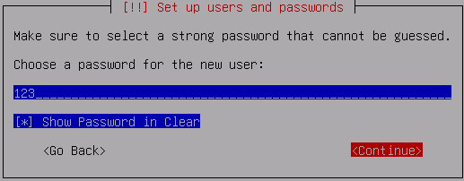


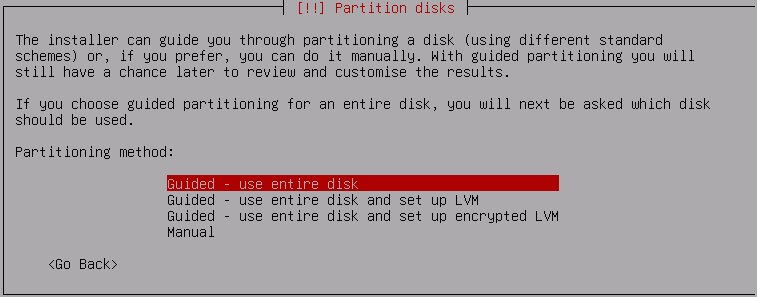
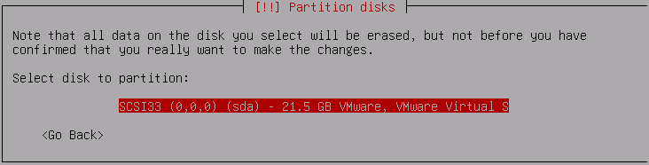


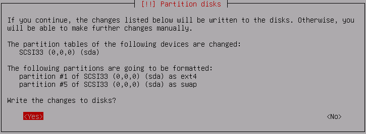
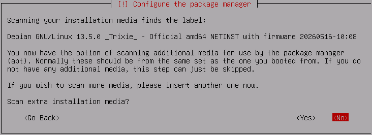
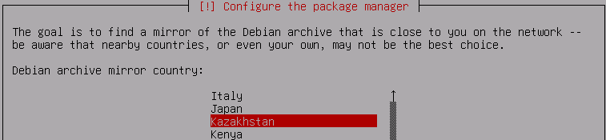
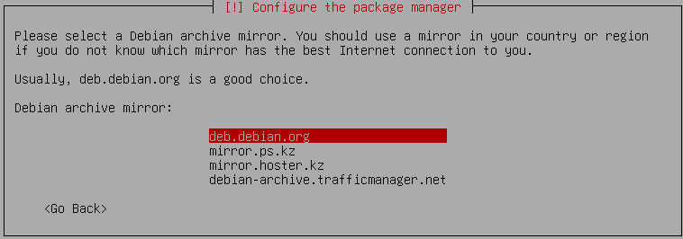
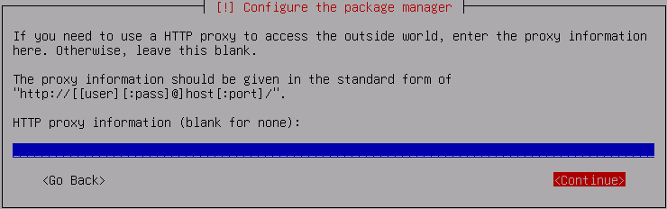
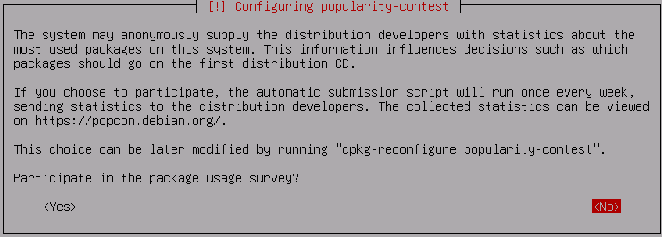

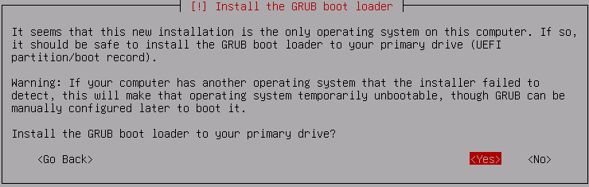


**1-қадам: Add a User to the Sudo Group**
```shell
root@debian:~# groups student
root@debian:~# usermod -aG sudo student
root@debian:~# groups student
```

```shell
root@debian:~# ping -c2 google.com
root@debian:~# apt install sudo
root@debian:~# reboot
```

**2-қадам: Update and Upgrade**
```shell
student@debian:~$ sudo apt update
student@debian:~$ sudo apt upgrade -y
```

**3-қадам: System Information**
```shell
student@debian:~$ uname -sr
student@debian:~$ lsb_release -a
student@debian:~$ cat /etc/debian_version
```

**4-қадам: Verify SSH Connectivity**
```shell
student@debian:~$ sudo systemctl status sshd

student@debian:~$ ip address
```

**5-қадам: Banner Messages**

**Configure Console Login Banner**

```shell
student@debian:~$ sudo nano /etc/issue
\S \l
Kernel \r

************************************
Username: student
Password: 123
************************************
ENTER
ENTER

CTRL+O, ENTER, CTRL+X
CTRL+L
```
`\S` - OS name  
`\l` - TTY name  
`\r` - Kernel release  

**Configure Remote Login Banner**

```shell
student@debian:~$ sudo nano /etc/issue.net

************************************
Authorized access only!
Unauthorized access is prohibited.
************************************
ENTER
ENTER

CTRL+O, ENTER, CTRL+X
CTRL+L
```

```shell
student@debian:~$ sudo nano /etc/ssh/sshd_config
Banner /etc/issue.net

student@debian:~$ sudo systemctl restart ssh
```

**MOTD (Message of the Day)**

```shell
student@debian:~$ sudo nano /etc/motd
```

**6-қадам: Clear Bash History**

```shell
student@debian:~$ history

student@debian:~$ ls -la
student@debian:~$ cat /dev/null > ~/.bash_history
student@debian:~$ history -c
```

```shell
student@debian:~$ logout

debian login: root
password: P@s$w0rd

root@debian:~#
```

```shell
root@debian:~# history

root@debian:~# ls -la
root@debian:~# cat /dev/null > ~/.bash_history
root@debian:~# history -c

root@debian:~# reboot
```

**7-қадам: Power Off**
```shell
student@debian:~$ sudo poweroff
```

**8-қадам: Description**  

VMware Workstation -> Description  

Username: student  
Password: 123  

Username: root  
Password: P@s$w0rd  

**9-қадам: Take Snapshot**  
  
Snapshot Manager -> Take Snapshot -> initial image  
